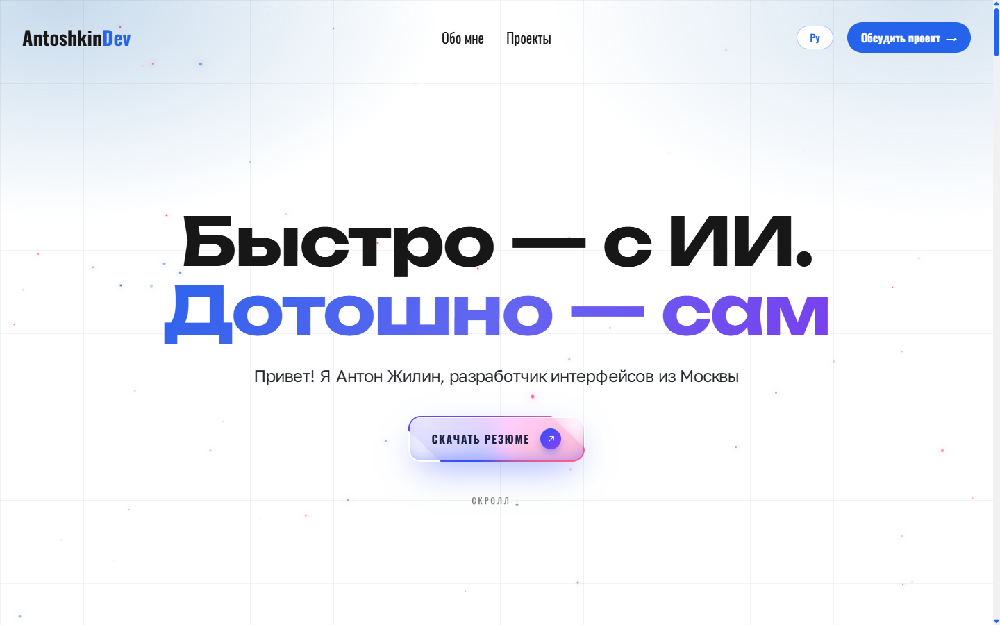

# Портфолио фронтенд-разработчика — Антон Жилин

Персональный сайт-портфолио (SPA) фронтенд-разработчика, построенный на **React 19** и **Vite 8**. Двуязычный интерфейс (русский по умолчанию, английский), плавные анимации, адаптивная вёрстка и SEO-оптимизация.




---

## 📑 Содержание

- [📈 Последние улучшения](#-последние-улучшения)
- [✨ Возможности](#-возможности)
- [📄 Страницы и их функции](#-страницы-и-их-функции)
- [🧰 Технологический стек](#-технологический-стек)
- [🧩 Архитектура](#-архитектура)
- [🚀 Установка и запуск](#-установка-и-запуск)
- [💡 Примеры использования](#-примеры-использования)
- [❓ FAQ](#-faq)

---

## 📈 Последние улучшения

### Миграция на Vite 8 и React 19 (август 2026)

Проект переехал с мёртвого Create React App на Vite и поднялся до React 19 вместе со всеми зависимостями. Архитектура `src/`, вёрстка и дизайн не менялись — это замена инструментов, а не переписывание приложения.

**Инструменты сборки**

- Create React App (`react-scripts` 5) → **Vite 8**, ESLint 9 на flat config вместо конфига CRA
- Jest ушёл вместе с `react-scripts` → **Vitest** + Testing Library
- Появился настоящий `npm run lint`, которого в проекте не было

**Зависимости**

| Пакет                | Было  | Стало                                   |
| -------------------- | ----- | --------------------------------------- |
| `react`/`react-dom`  | 18.2  | **19.2.8**                              |
| `react-router-dom`   | 6.11  | **7.18.2**                              |
| `framer-motion`      | 10.15 | **`motion` 12.43** (пакет переименован) |
| `i18next`            | 24.2  | **26.3.6**                              |
| `react-i18next`      | 15.4  | **17.0.11**                             |
| `swiper`             | 11.2  | **14.0.7**                              |
| `react-icons`        | 4.10  | **5.7.0**                               |
| `react-helmet-async` | 2.0.5 | **удалён**                              |

**Скорость разработки**

| Метрика                    | CRA  | Vite       |
| -------------------------- | ---- | ---------- |
| Прод-сборка                | 71 с | **1.3 с**  |
| Холодный старт дев-сервера | —    | **227 мс** |

**SEO без библиотеки.** `react-helmet-async` удалён — React 19 сам поднимает `<title>`, `<meta>` и `<link>` в `<head>`. Схемы JSON-LD `Person` и `WebSite` переехали статикой в `index.html`, поэтому поисковые роботы видят их **без выполнения JavaScript** (раньше они внедрялись только на клиенте).

**Исправлено по пути**

- Выбор языка больше не сбрасывался на русский: восстановление языка гонялось с собственным сохранением в `localStorage`, и под StrictMode возвращало `ru`. Начальный язык теперь разрешается синхронно, до первого рендера
- Закрыта critical-уязвимость prototype pollution в `swiper`
- `prop-types` объявлен явно — 36 файлов импортировали его, а в `package.json` пакета не было

**Вес бандла**

JS gzip вырос со 183.8 до 202.9 kB. Прибавку дали намеренные апгрейды — в основном масса `react-dom` 19 (≈ +16 kB) и `motion` 12 (≈ +2.6 kB), частично отыграно снятием Helmet (≈ −7 kB). Сама смена сборщика веса не добавила: сразу после переезда на Vite, ещё на React 18, был паритет с CRA. Ленивая загрузка страниц и тяжёлых секций сохранена полностью.

> [!NOTE]
> Подробный разбор миграции — рисков, отступлений от плана и найденных багов — в `.claude/migration/MIGRATION.md`.

---

### v1.1 — мобильная адаптация и оптимизация (июнь 2026)

#### Мобильная адаптация

- Hero-секция стала резиновой по высоте на мобильных (убран `min-height: 100dvh` ниже 768px)
- Единая система отступов для всех секций: `4rem` на ≤768px, `3rem` на ≤475px
- `border-radius: 16px` у всех контентных секций на мобильном
- Улучшена читаемость заголовка Hero на русском: пирамидальный перенос строк через `<Trans>` + `<br/>`
- Исправлены висячие слова в заголовках (неразрывный пробел ` `)

### Оптимизация бандла

- Исправлен tree-shaking Framer Motion (`LazyMotion + domAnimation` вместо полного `motion`)
- Удалены неиспользуемые зависимости (`react-type-animation`, `ajv`, `ajv-keywords`)
- Секции `Showcasing` и `Testimonials` переведены на `React.lazy` — Swiper (~93 KB) вынесен из main chunk
- **main.js: 174.96 KB → 144.57 KB** (gzip, −17%)

#### Метрики Lighthouse (desktop)

| Метрика                  | Значение      |
| ------------------------ | ------------- |
| 🟢 Performance           | **98 / 100**  |
| 🟢 Accessibility         | **95 / 100**  |
| 🟢 Best Practices        | **100 / 100** |
| 🟢 SEO                   | **100 / 100** |
| First Contentful Paint   | **0.8 s**     |
| Largest Contentful Paint | **1.0 s**     |
| Total Blocking Time      | **20 ms**     |
| Cumulative Layout Shift  | **0**         |
| Speed Index              | **0.8 s**     |

> [!WARNING]
> Цифры этого блока — исторические, замерены на сборке CRA **до** миграции. Файла `main.js` больше не существует (Vite собирает в `build/assets/`), а Lighthouse после переезда на Vite и React 19 не перезамерялся. Актуальные показатели веса — в блоке о миграции выше.

---

## ✨ Возможности

- 🌐 **Двуязычность (i18n)** — переключение RU/EN на лету. Выбранный язык хранится в URL (`?lang=`) и `localStorage`, поэтому ссылку можно расшарить с нужным языком.
- 🎨 **Анимации** — переходы и эффекты на Motion, анимированный звёздный фон.
- 🗂 **Фильтрация проектов** — фильтры по технологиям (All / React / Next / JavaScript).
- 📱 **Адаптивность** — отдельные изображения проектов для desktop / tablet / mobile, резиновая вёрстка на мобильных.
- ⚡ **Производительность** — code-splitting страниц и тяжёлых секций через `React.lazy`, мемоизация компонентов, оптимизированный tree-shaking Motion.
- 🔍 **SEO** — нативные метаданные React 19 (`title`, `description`, `canonical`, `hreflang`, Open Graph), локализованные мета-теги, JSON-LD `Person`/`WebSite` статикой в `index.html`.
- ♿ **Доступность** — скрытые заголовки `h1`, `aria-label`, обработка `Escape` и блокировка прокрутки для модальных окон.
- 📨 **Форма обратной связи** — встроена в секцию «Контакты», отправляет письма через Web3Forms (без бэкенда). Рядом — копирование email в буфер и ссылки на соцсети (GitHub, Telegram, VK, MAX).
- 🧪 **Тесты** — Vitest; файлы лежат рядом с тестируемым кодом (`*.test.js`).

---

## 📄 Страницы и их функции

Приложение — одностраничное (SPA) с клиентской маршрутизацией. Все маршруты обёрнуты в общий `Layout` (Header → контент → кнопка «Наверх» → Footer).

| Маршрут     | Страница                     | Что отображает                                                                               |
| ----------- | ---------------------------- | -------------------------------------------------------------------------------------------- |
| `/`         | **Главная** (`HomePage`)     | Промо-блок, «Обо мне», витрина (Showcasing), услуги, преимущества, FAQ, контакты             |
| `/about`    | **Обо мне** (`AboutPage`)    | Хлебные крошки, фото и данные автора, навыки/возможности, опыт работы, образование, контакты |
| `/projects` | **Проекты** (`ProjectsPage`) | Список проектов с фильтрацией по технологиям и контактами                                    |
| `*`         | **404** (`PageNotFound`)     | Страница для несуществующих маршрутов                                                        |

Страницы `About`, `Projects` и `404` загружаются лениво (code-splitting); главная — сразу.

---

## 🧰 Технологический стек

| Категория     | Технология                                                |
| ------------- | --------------------------------------------------------- |
| Сборка        | Vite 8 (`@vitejs/plugin-react`)                           |
| UI            | React 19 (функциональные компоненты + хуки)               |
| Язык          | JavaScript (JSX), типизация через JSDoc                   |
| Маршрутизация | React Router DOM v7                                       |
| Состояние     | Context API (глобальное) + `useReducer` (фильтр проектов) |
| Локализация   | i18next 26 + react-i18next 17                             |
| Анимации      | Motion 12 (бывший Framer Motion)                          |
| Слайдеры      | Swiper 14                                                 |
| SEO           | Нативные метаданные React 19                              |
| Форма         | Web3Forms (отправка писем без бэкенда)                    |
| Тесты         | Vitest + Testing Library                                  |
| Линт          | ESLint 9 (flat config)                                    |
| Иконки        | React Icons 5                                             |
| Меню          | hamburger-react                                           |
| Стили         | Обычный CSS с БЭМ-неймингом                               |

---

## 🧩 Архитектура

```
├── index.html            # Точка входа Vite (в корне, не в public/) + статический JSON-LD
├── vite.config.js        # Конфиг сборки и Vitest
├── eslint.config.js      # Flat config ESLint 9
├── public/               # Копируется в билд как есть (favicon, manifest, robots, sitemap)
└── src/
    ├── index.jsx         # Монтирование: StrictMode + инициализация i18n
    ├── App.jsx           # Роутер, провайдеры, ленивые страницы
    ├── setupTests.js     # Матчеры jest-dom для Vitest
    ├── pages/            # Страницы-маршруты (Home, About, Projects, 404)
    ├── sections/         # Крупные секции страниц (promo, about, projects, faq, ...)
    ├── components/       # Переиспользуемые компоненты (папка + ComponentName.jsx + style.css)
    ├── layouts/          # Каркас: Header, Footer, Layout
    ├── hooks/            # Кастомные хуки (useLanguage, useUrlParams, useProjectsFilter, ...)
    ├── context/          # LanguageProvider (контекст языка)
    ├── const/index.jsx   # Константы и данные (маршруты, услуги, FAQ, навыки)
    ├── api/              # Отправка формы через Web3Forms
    ├── utils/
    │   ├── lang.js       # Резолвер начального языка (общий для i18next и провайдера)
    │   └── i18n/         # Настройка i18next и словари locales/{en,ru}
    ├── assets/           # Изображения (.webp), шрифты, PDF
    └── styles/           # Глобальные стили (main.css)
```

> [!NOTE]
> Файлы с JSX обязаны иметь расширение `.jsx` — esbuild не разбирает JSX внутри `.js`. Это касается и модулей данных: `const/index.jsx` и `components/socials/socials.jsx` содержат элементы иконок, поэтому названы так; `sections/projects/projects.js` — чистые данные и остаётся `.js`.

**Локализация — ключевая особенность.** Большая часть текста в коде — это **ключи перевода** (например, `projects.vamvoda.title`), а не готовые строки. Реальный текст лежит в `src/utils/i18n/locales/en/en.json` и `ru/ru.json` — чтобы изменить надпись, правьте словари (синхронно оба языка), а не компоненты.

**Переключение языка — двухуровневое:**

1. `context/LanguageProvider.jsx` хранит состояние `lang`, синхронизирует его с URL-параметром `?lang=` и сохраняет в `localStorage` (`preferredLang`).
2. Хук `hooks/useLanguage.jsx` читает контекст и вызывает `i18n.changeLanguage(lang)` — именно он переключает активный язык i18next.

Начальный язык оба слоя берут из одного резолвера — `resolveInitialLang()` в `src/utils/lang.js`, приоритет `?lang=` → `localStorage` → `ru`. Он вызывается синхронно, до первого рендера, поэтому i18next и провайдер всегда стартуют с одним языком. Не возвращайте восстановление языка в эффект: прошлая версия гонялась с собственным сохранением в `localStorage` и под StrictMode сбрасывала выбор на `ru` (регрессию стережёт `utils/lang.test.js`).

**Фильтрация проектов** реализована редьюсером `sections/projects/projectsReduce.js` (экшен `SET_FILTER`) и хуком `useProjectsFilter`.

**Интеграции:** своего бэкенда нет — это статический клиентский сайт. Форма обратной связи отправляется во внешний сервис Web3Forms (`src/api/contactApi.js`), ссылки на соцсети лежат в `src/components/socials/socials.jsx`.

---

## 🚀 Установка и запуск

### Требования

- **Node.js** `^20.19.0 || >=22.12.0` и **npm** (требование Vite 8).
- Git.

### Шаги

```bash
# 1. Клонировать репозиторий
git clone <url-репозитория>
cd my-portfolio-react

# 2. Установить зависимости
npm install

# 3. Создать .env.local по образцу и вписать ключ Web3Forms
cp .env.local.example .env.local

# 4. Запустить в режиме разработки (http://localhost:3000)
npm start
```

> [!IMPORTANT]
> Без `.env.local` с переменной `VITE_WEB3FORMS_KEY` форма обратной связи **молча не отправится** — сборка при этом пройдёт без ошибок, а Web3Forms вернёт `invalid_access_key`. Ключ бесплатно выдаётся на [web3forms.com](https://web3forms.com). Префикс `VITE_` обязателен: Vite отдаёт в браузер только переменные с ним.

### Доступные команды

| Команда            | Назначение                                      |
| ------------------ | ----------------------------------------------- |
| `npm start`        | Дев-сервер с HMR на `localhost:3000`            |
| `npm run build`    | Продакшен-сборка в каталог `build/`             |
| `npm run preview`  | Локальная раздача собранного билда              |
| `npm test`         | Тесты в watch-режиме (Vitest)                   |
| `npm run test:run` | Тесты одним прогоном                            |
| `npm run lint`     | Проверка ESLint по `src`                        |
| `npm run prod`     | Сборка и раздача статики через `serve -s build` |
| `npm run analyze`  | Анализ размера бандла (`source-map-explorer`)   |

---

## 💡 Примеры использования

### Для пользователей

- **Сменить язык** — кнопка переключения RU/EN в шапке. Язык запоминается; ссылку `сайт/projects?lang=en` можно отправить сразу на английском.
- **Посмотреть проекты** — раздел «Проекты», фильтры по технологиям (React / Next / JavaScript) сужают список.
- **Связаться** — форма в секции «Контакты» внизу любой страницы; рядом кнопка копирования email и ссылки на GitHub, Telegram, VK, MAX. Отдельная кнопка «Как происходит заказ?» открывает модальное окно с этапами работы.

### Для разработчиков

Добавить новый переиспользуемый компонент (по конвенциям проекта — папка в camelCase, файл в PascalCase, стили рядом):

```jsx
// src/components/greetingMessage/GreetingMessage.jsx
import './style.css';

/**
 * Пример компонента-сообщения.
 * @component
 * @returns {JSX.Element}
 */
const GreetingMessage = () => {
  return <p className="greeting-message">Привет!</p>;
};

export default GreetingMessage;
```

Добавить перевод — в оба словаря синхронно:

> [!IMPORTANT]
> Ключи в `ru.json` и `en.json` должны совпадать. Если добавить ключ только в один словарь, второй язык покажет либо сам ключ, либо устаревший текст.

```jsonc
// src/utils/i18n/locales/ru/ru.json
{ "greeting": { "hello": "Привет" } }
// src/utils/i18n/locales/en/en.json
{ "greeting": { "hello": "Hello" } }
```

```jsx
import { useTranslation } from 'react-i18next';

const Hello = () => {
  const { t } = useTranslation();
  return <span>{t('greeting.hello')}</span>;
};
```

---

## ❓ FAQ

**На каком языке открывается сайт по умолчанию?**
На русском. Язык можно переключить кнопкой; выбор сохраняется в `localStorage` и URL.

**Где менять тексты?**
В словарях `src/utils/i18n/locales/ru/ru.json` и `.../en/en.json` — компоненты используют ключи, а не сами строки. Меняйте оба файла, чтобы языки не разошлись.

**Как добавить новый проект в портфолио?**
Добавьте запись в `src/sections/projects/projects.js` (изображения — в `src/assets/projects/`, тексты — ключами в словари) и при необходимости новый фильтр в массив `filters` в `src/const/index.jsx`.

**Используется ли TypeScript / Redux?**
Нет. Проект на чистом JavaScript (типизация через JSDoc), глобальное состояние — Context API. Их добавление не планируется без согласования.

**Есть ли бэкенд или база данных?**
Нет. Это статический клиентский сайт без серверной части. Единственный внешний вызов — отправка формы обратной связи в Web3Forms.

**Как запустить тесты?**
`npm test` — watch-режим, `npm run test:run` — один прогон. Тесты лежат рядом с тестируемым файлом (`projectsReduce.test.js`, `lang.test.js`).

**Как задеплоить?**
Соберите проект (`npm run build`) и разместите содержимое каталога `build/` на любом статическом хостинге (Netlify, Vercel, GitHub Pages, Nginx и т.п.). Локально проверить продакшен-сборку — `npm run prod`.

**Каким стандартам следуют коммиты?**
Conventional Commits (`type(scope): описание`). Подробности — в `CLAUDE.md`.
