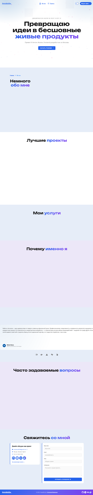

# Портфолио фронтенд-разработчика — Антон Жилин

Персональный сайт-портфолио (SPA) фронтенд-разработчика, построенный на **React 18**. Двуязычный интерфейс (русский по умолчанию, английский), плавные анимации, адаптивная вёрстка и SEO-оптимизация.



---

## Содержание

- [Возможности](#возможности)
- [Страницы и их функции](#страницы-и-их-функции)
- [Технологический стек](#технологический-стек)
- [Архитектура](#архитектура)
- [Установка и запуск](#установка-и-запуск)
- [Примеры использования](#примеры-использования)
- [FAQ](#faq)

---

## Возможности

- 🌐 **Двуязычность (i18n)** — переключение RU/EN на лету. Выбранный язык хранится в URL (`?lang=`) и `localStorage`, поэтому ссылку можно расшарить с нужным языком.
- 🎨 **Анимации** — переходы и эффекты на Framer Motion, анимированный звёздный фон.
- 🗂 **Фильтрация проектов** — фильтры по технологиям (All / React / Next / JavaScript).
- 📱 **Адаптивность** — отдельные изображения проектов для desktop / tablet / mobile.
- ⚡ **Производительность** — code-splitting страниц через `React.lazy`, мемоизация компонентов.
- 🔍 **SEO** — управление `<head>` (title, description, keywords) через `react-helmet-async`, локализованные мета-теги.
- ♿ **Доступность** — скрытые заголовки `h1`, `aria-label`, обработка `Escape` и блокировка прокрутки для модальных окон.
- 📨 **Форма связи** — модальное окно обратной связи и ссылки на соцсети (GitHub, Telegram, VK, MAX).

---

## Страницы и их функции

Приложение — одностраничное (SPA) с клиентской маршрутизацией. Все маршруты обёрнуты в общий `Layout` (Header → контент → кнопка «Наверх» → Footer).

| Маршрут | Страница | Что отображает |
| --- | --- | --- |
| `/` | **Главная** (`HomePage`) | Промо-блок, «Обо мне», витрина (Showcasing), услуги, преимущества, FAQ, контакты |
| `/about` | **Обо мне** (`AboutPage`) | Хлебные крошки, фото и данные автора, навыки/возможности, опыт работы, образование, контакты |
| `/projects` | **Проекты** (`ProjectsPage`) | Список проектов с фильтрацией по технологиям и контактами |
| `*` | **404** (`PageNotFound`) | Страница для несуществующих маршрутов |

Страницы `About`, `Projects` и `404` загружаются лениво (code-splitting); главная — сразу.

---

## Технологический стек

| Категория | Технология |
| --- | --- |
| Фреймворк / сборка | Create React App (`react-scripts` 5) |
| UI | React 18 (функциональные компоненты + хуки) |
| Язык | JavaScript (JSX), типизация через JSDoc |
| Маршрутизация | React Router DOM v6 (с future-флагами v7) |
| Состояние | Context API (глобальное) + `useReducer` (фильтр проектов) |
| Локализация | i18next + react-i18next |
| Анимации | Framer Motion |
| Слайдеры | Swiper |
| SEO | react-helmet-async |
| Иконки | React Icons |
| Меню | hamburger-react |
| Стили | Обычный CSS с БЭМ-неймингом |

---

## Архитектура

```
src/
├── index.js              # Точка входа: StrictMode + HelmetProvider + инициализация i18n
├── App.jsx               # Роутер, провайдеры, ленивые страницы
├── pages/                # Страницы-маршруты (Home, About, Projects, 404)
├── sections/             # Крупные секции страниц (promo, about, projects, faq, ...)
├── components/           # Переиспользуемые компоненты (папка + ComponentName.jsx + style.css)
├── layouts/              # Каркас: Header, Footer, Layout
├── hooks/                # Кастомные хуки (useLanguage, useUrlParams, useProjectsFilter, ...)
├── context/              # LanguageProvider (контекст языка)
├── const/                # Константы и данные (маршруты, услуги, FAQ, навыки)
├── utils/i18n/           # Настройка i18next и словари locales/{en,ru}
├── assets/               # Изображения (.webp), шрифты, PDF
└── styles/               # Глобальные стили (main.css)
```

**Локализация — ключевая особенность.** Большая часть текста в коде — это **ключи перевода** (например, `projects.vamvoda.title`), а не готовые строки. Реальный текст лежит в `src/utils/i18n/locales/en/en.json` и `ru/ru.json` — чтобы изменить надпись, правьте словари (синхронно оба языка), а не компоненты.

**Переключение языка — двухуровневое:**
1. `context/LanguageProvider.jsx` хранит состояние `lang`, синхронизирует его с URL-параметром `?lang=` и сохраняет в `localStorage` (`preferredLang`).
2. Хук `hooks/useLanguage.jsx` читает контекст и вызывает `i18n.changeLanguage(lang)` — именно он переключает активный язык i18next.

**Фильтрация проектов** реализована редьюсером `sections/projects/projectsReduce.js` (экшен `SET_FILTER`) и хуком `useProjectsFilter`.

**Интеграции:** внешних API нет — это статический клиентский сайт. Связь — через модальную форму и ссылки на соцсети (`src/components/socials/socials.js`).

---

## Установка и запуск

### Требования
- **Node.js** 16+ и **npm** (проект на CRA 5).
- Git.

### Шаги

```bash
# 1. Клонировать репозиторий
git clone <url-репозитория>
cd my-portfolio-react

# 2. Установить зависимости
npm install

# 3. Запустить в режиме разработки (http://localhost:3000)
npm start
```

### Доступные команды

| Команда | Назначение |
| --- | --- |
| `npm start` | Дев-сервер с hot-reload на `localhost:3000` |
| `npm run build` | Продакшен-сборка в каталог `build/` |
| `npm test` | Запуск тестов (Jest, watch-режим) |
| `npm run prod` | Сборка и раздача статики через `serve -s build` |
| `npm run analyze` | Анализ размера бандла (`source-map-explorer`) |

> Линтинг встроен в `react-scripts` (конфиг `react-app`). Отдельной команды `npm run lint` нет — для разовой проверки используйте `npx eslint src`.

---

## Примеры использования

### Для пользователей
- **Сменить язык** — кнопка переключения RU/EN в шапке. Язык запоминается; ссылку `сайт/projects?lang=en` можно отправить сразу на английском.
- **Посмотреть проекты** — раздел «Проекты», фильтры по технологиям (React / Next / JavaScript) сужают список.
- **Связаться** — кнопка обратной связи открывает модальное окно; в подвале есть ссылки на GitHub, Telegram, VK, MAX.

### Для разработчиков

Добавить новый переиспользуемый компонент (по конвенциям проекта — папка в camelCase, файл в PascalCase, стили рядом):

```jsx
// src/components/greetingMessage/GreetingMessage.jsx
import './style.css';

/**
 * Пример компонента-сообщения.
 * @component
 * @returns {JSX.Element}
 */
const GreetingMessage = () => {
  return <p className="greeting-message">Привет!</p>;
};

export default GreetingMessage;
```

Добавить перевод — в оба словаря синхронно:

```jsonc
// src/utils/i18n/locales/ru/ru.json
{ "greeting": { "hello": "Привет" } }
// src/utils/i18n/locales/en/en.json
{ "greeting": { "hello": "Hello" } }
```

```jsx
import { useTranslation } from 'react-i18next';

const Hello = () => {
  const { t } = useTranslation();
  return <span>{t('greeting.hello')}</span>;
};
```

---

## FAQ

**На каком языке открывается сайт по умолчанию?**
На русском. Язык можно переключить кнопкой; выбор сохраняется в `localStorage` и URL.

**Где менять тексты?**
В словарях `src/utils/i18n/locales/ru/ru.json` и `.../en/en.json` — компоненты используют ключи, а не сами строки. Меняйте оба файла, чтобы языки не разошлись.

**Как добавить новый проект в портфолио?**
Добавьте запись в `src/sections/projects/projects.js` (изображения — в `src/assets/projects/`, тексты — ключами в словари) и при необходимости новый фильтр в массив `filters` в `src/const/index.js`.

**Используется ли TypeScript / Redux?**
Нет. Проект на чистом JavaScript (типизация через JSDoc), глобальное состояние — Context API. Их добавление не планируется без согласования.

**Есть ли бэкенд или база данных?**
Нет. Это статический клиентский сайт без серверной части и внешних API.

**Как задеплоить?**
Соберите проект (`npm run build`) и разместите содержимое каталога `build/` на любом статическом хостинге (Netlify, Vercel, GitHub Pages, Nginx и т.п.). Локально проверить продакшен-сборку — `npm run prod`.

**Каким стандартам следуют коммиты?**
Conventional Commits (`type(scope): описание`). Подробности — в `CLAUDE.md`.
